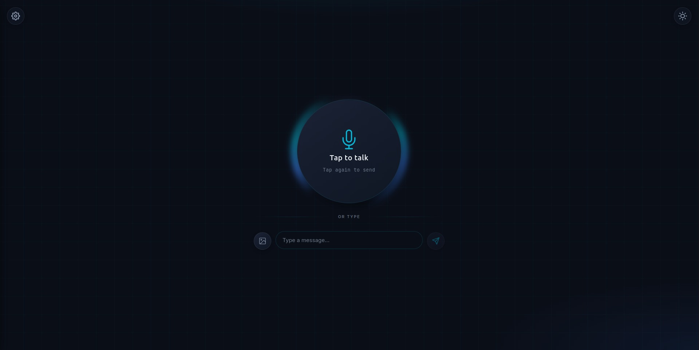
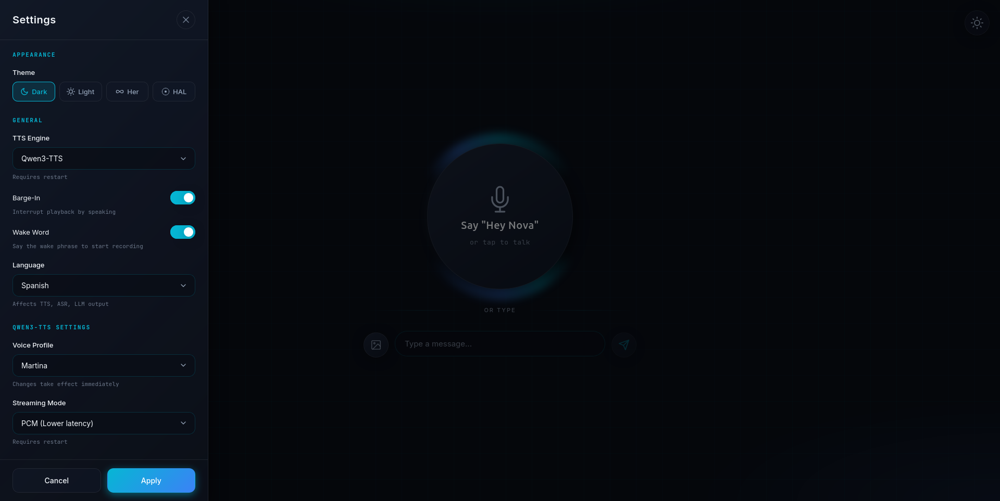

# OVA

|||
|:--:|:--:|

A **fully-local** AI voice assistant with real-time streaming TTS, voice cloning, and multimodal (image + text) support. Built with a FastAPI backend and modern web frontend. All models (ASR / LLM / TTS) run locally with open weights - no data is sent to the Internet.

## Features

- **[Real-time PCM streaming TTS](#streaming-modes)** - Low-latency audio with Web Audio API AudioWorklet
- **[Streaming ASR](#streaming-asr-websocket-v1speech-to-textstream)** - Real-time transcription via WebSocket as you speak
- **[Voice cloning](#qwen3-voice-profiles)** - Clone any voice from a 5-15 second audio sample
- **[Two-phase streaming](#streaming-tuning-advanced)** - Aggressive first chunk for lower TTFB, then stable quality
- **[Early TTS decode](#why-the-first-sentence-matters-for-ttfb)** - Interleaved LLM→TTS for faster time-to-first-byte (~200-300ms reduction)
- **[Hot-reload](#hot-reload-settings)** - Switch voice/language without restart
- **Multi-language support** - 10 languages: zh, en, ja, ko, de, fr, ru, pt, es, it
- **[Multimodal input](#multimodal-image--text)** - Attach images to chat queries for vision-language responses
- **[Barge-in](#barge-in--wake-word)** - Interrupt TTS playback by speaking (Silero VAD speech detection)
- **[Wake word](#barge-in--wake-word)** - Always-on "Hey Nova" detection with VAD-gated streaming ASR
- **[Prosody control](#prosody-silence-tags--optional)** - `[pause:X]` tags for deliberate silences in speech
- **[Tool calling](#tools--function-calling)** - LLM can invoke real Python functions (timers, datetime, web search) with real-time push notifications via SSE
- **[MCP client](#mcp-external-tool-servers---experimental)** - Connect to external [MCP](https://modelcontextprotocol.io/) servers for additional tool capabilities (filesystem, databases, APIs) without writing code
- **[Themes](static/README.md#theming-system)** - Dark, Light, Her (Samantha), and HAL-9000
- **[torch.compile optimizations](#streaming-modes)** - Up to 1.7x speedup after JIT warmup

## Quick Start

### Pre-requisites

- Linux (x86_64)
- Python >= 3.13
- `uv` installed and available in PATH
- **LLM provider** (one of):
  - [Ollama](https://ollama.com/) installed and running (default)
  - Any OpenAI-compatible API — local or remote (`OVA_LLM_PROVIDER=openai`)
- NVIDIA GPU (Ampere or newer) with CUDA 13.0 — all dependencies are pinned to this version:
  - PyTorch 2.9.1+cu130 (from `pytorch-cu130` index)
  - onnxruntime-gpu (from `ort-cuda-13-nightly` index)
  - flash-attn 2.8.3+cu131 (prebuilt wheel for torch 2.9 / Python 3.13 / linux x86_64)
  - If your CUDA version or OS differs, you'll need to install compatible builds of these packages separately

### Install & Run

```bash
./ova.sh install
```

See [QUICKSTART.md](QUICKSTART.md) for voice profile setup and `.env` configuration.

```bash
./ova.sh start
```

This starts two services:
- **Backend** (FastAPI): http://localhost:5173 — ASR + LLM + TTS pipeline
- **Frontend** (static): http://localhost:8080 — open this in your browser

Logs: `tail -f .ova/backend.log` (add `OVA_DEBUG=true` to `.env` for verbose output).

### Minimal Configuration

The defaults .env. examples will work for most setups. The common things to change in `.env`:

| Variable | Default | What to change |
|----------|---------|----------------|
| `OVA_LANGUAGE` | `es` | Your language (`en`, `de`, `fr`, `ja`, etc.) |
| `OVA_QWEN3_VOICE` | `myvoice` | Voice profile (see [generate_voice_prompts script](https://github.com/rekuenkdr/ova/tree/main/scripts#generate_voice_promptspy) ) |
| `OVA_LLM_PROVIDER` | `ollama` | Set to `openai` for OpenAI-compatible APIs |

> See [Configuration](#configuration) for the full list of settings.

## Models

| Component | Model |
|-----------|-------|
| ASR | [Qwen3-ASR-0.6B](https://huggingface.co/Qwen/Qwen3-ASR-0.6B) (embedded subprocess) |
| LLM | [Mistral ministral-3 3b 4-bit](https://ollama.com/library/ministral-3:3b-instruct-2512-q4_K_M) (Ollama or any OpenAI-compatible server) |
| TTS | [Qwen3-TTS 1.7B](https://huggingface.co/Qwen/Qwen3-TTS-12Hz-1.7B-Base) |
| TTS (Alternative) | [Qwen3-TTS 0.6B](https://huggingface.co/Qwen/Qwen3-TTS-12Hz-0.6B-Base) |
| TTS (Alternative) | [Hexgrad Kokoro 82M](https://huggingface.co/hexgrad/Kokoro-82M) |
| VAD | [Silero VAD v6](https://github.com/snakers4/silero-vad) (ONNX, client-side) |


### Qwen3-TTS Streaming Fork

This project uses a custom fork of Qwen3-TTS with streaming optimizations:

**[rekuenkdr/Qwen3-TTS-streaming](https://github.com/rekuenkdr/Qwen3-TTS-streaming)**

Key improvements over upstream:
- **Two-phase streaming** - Aggressive first chunk settings for lower TTFB, then stable settings for quality
- **Hann window crossfading** - Smooth audio chunk transitions handled internally by the TTS engine
- **Overlap removal** - Proper deduplication at chunk boundaries (no more audio stuttering)


## Architecture

```
┌─────────────────┐                   ┌─────────────────┐
│   Frontend      │ ───────────────▶  │   Backend       │
│   (index.html)  │   HTTP/WebSocket  │   (FastAPI)     │
│   Port 8080     │ ◀───────────────  │   Port 5173     │
└─────────────────┘                   └────────┬────────┘
                                               │
                    ┌──────────────────────────┴──────────────────────────┐
                    │                   OVAPipeline                        │
                    │  ┌─────────────┐  ┌─────────────┐  ┌─────────────┐  │
                    │  │ ASR Process │  │    LLM      │  │ TTS Engine  │  │
                    │  │ (Unix sock) │  │ (Ollama/OAI)│  │ (Qwen3/Kok) │  │
                    │  └─────────────┘  └─────────────┘  └─────────────┘  │
                    └─────────────────────────────────────────────────────┘
```

The ASR subprocess uses Unix socket IPC (not multiprocessing.Pipe) to avoid vLLM's stdout conflicts and ensure clean CUDA context isolation. ASR runs in a separate subprocess spawned **before** torch imports so vLLM gets a clean CUDA context and uses `fork` (5-10x faster startup). The IPC protocol uses pickle serialization over Unix sockets for efficient numpy array transfer.

## How It Works

1. Frontend captures audio/text (optionally with an image) and sends to the backend
2. Backend processes the request:
   - Transcribes audio using embedded ASR subprocess (or streaming via WebSocket)
   - Sends text + optional image to the LLM
   - **Early TTS decode**: Starts TTS before full LLM response (reduces TTFB by ~200-300ms)
   - **Two-phase streaming**: Aggressive first chunk settings, then stable streaming
3. Frontend plays audio as it arrives using an AudioWorklet processor

On an RTX 5060Ti (16GB VRAM), with Qwen3-TTS streaming optimizations enabled, TTFB is ~785ms after warmup with the 1.7B Model.

## Configuration

### Key Settings

| Variable | Description | Default |
|----------|-------------|---------|
| `OVA_DEBUG` | Enable verbose logging for all components | `false` |
| `OVA_LANGUAGE` | Language code (zh, en, ja, ko, de, fr, ru, pt, es, it) | `es` |
| `OVA_LLM_PROVIDER` | LLM backend: `ollama` or `openai` (any OpenAI-compatible server) | `ollama` |
| `OVA_TTS_ENGINE` | TTS engine: `qwen3` (voice clone) or `kokoro` | `qwen3` |
| `OVA_QWEN3_VOICE` | Voice profile name (see Voice Profiles) | `myvoice` |
| `OVA_QWEN3_STREAM_FORMAT` | Streaming format: `pcm` or `wav` | `pcm` |
| `OVA_ENABLE_STREAMING_OPTIMIZATIONS` | Enable torch.compile | `true` |
| `OVA_EARLY_TTS_DECODE` | Start TTS before full LLM response | `true` |
| `OVA_KOKORO_VOICE` | Kokoro voice preset | `af_heart` |
| `OVA_KOKORO_MODEL` | Kokoro model ID | `hexgrad/Kokoro-82M` |

### LLM Provider (OpenAI-Compatible)

When using `OVA_LLM_PROVIDER=openai`, the pipeline connects to any OpenAI-compatible API — whether local (vLLM, TensorRT-LLM, LMStudio, llama.cpp) or remote (OpenAI, Mistral, Together AI, etc.) — instead of Ollama. Tool calling, streaming, and all chat features work across both providers.

| Variable | Description | Default |
|----------|-------------|---------|
| `OVA_LLM_PROVIDER` | LLM backend: `ollama` or `openai` | `ollama` |
| `OVA_CHAT_MODEL` | Model name (used by both providers) | `ministral-3:3b-instruct-2512-q4_K_M` |
| `OVA_LLM_BASE_URL` | Base URL for the OpenAI-compatible API | `http://localhost:8000/v1` |
| `OVA_LLM_API_KEY` | API key (use `not-needed` for local servers without auth) | `not-needed` |

### Streaming Modes

| Mode | Latency | Description |
|------|---------|-------------|
| `pcm` | Lower | WAV header + raw PCM chunks. True streaming with AudioWorklet. |
| `wav` | Higher | Each chunk is a complete WAV file. |

PCM mode uses `reduce-overhead` torch.compile for ~1.5-1.7x speedup. The frontend pre-buffers ~0.4 seconds before playback to ensure smooth audio.

#### Audio Quality Validation

The pipeline includes runtime assertions to detect streaming issues:

- **Overlap detection**: Checks for duplicate audio at chunk boundaries (correlation > 0.85)
- **RMS continuity**: Detects sudden volume jumps between chunks (ratio > 3.0)

These log warnings but don't interrupt playback - useful for debugging voice quality issues.

### Streaming Tuning (Advanced)

| Variable | Description | Default |
|----------|-------------|---------|
| `OVA_PCM_EMIT_EVERY_FRAMES` | TTS emit frequency (lower = more chunks) | `12` |
| `OVA_PCM_PREBUFFER_SAMPLES` | Pre-buffer before playback (samples) | `9600` |
| `OVA_FIRST_CHUNK_EMIT_EVERY` | Aggressive emit interval for first chunk (0 to disable) | `5` |
| `OVA_FIRST_CHUNK_DECODE_WINDOW` | Decode window for first chunk phase | `48` |
| `OVA_FIRST_CHUNK_FRAMES` | Frames before switching to stable settings | `48` |

### Model-Specific Settings (Qwen3-TTS)

These values depend on which TTS model size you're using:

| Setting | 0.6B Model | 1.7B Model |
|---------|------------|------------|
| `OVA_PCM_DECODE_WINDOW` | `64` | `80` |
| `OVA_MAX_TTS_FRAMES` | `1500` | `8000` |
| `OVA_LLM_MAX_TOKENS` | `300` | `0` (unlimited) |

- **PCM_DECODE_WINDOW**: Decode window size for steady-state streaming
- **MAX_TTS_FRAMES**: Prevents runaway TTS generation (8000 ≈ 11 min at 12Hz)
- **LLM_MAX_TOKENS**: Limits LLM output to match TTS capacity

### ASR Settings

ASR runs embedded in the backend as an isolated subprocess (no separate server).

| Variable | Description | Default |
|----------|-------------|---------|
| `OVA_ASR_MODEL` | ASR model ID | `Qwen/Qwen3-ASR-0.6B` |
| `OVA_ASR_GPU_MEMORY_UTILIZATION` | GPU memory fraction for ASR | `0.4` |
| `OVA_ASR_MAX_MODEL_LEN` | Max sequence length | `2048` |
| `OVA_ASR_CHUNK_SIZE_SEC` | Audio chunk duration for streaming | `0.5` |
| `OVA_ASR_UNFIXED_CHUNK_NUM` | First N chunks without prefix prompting | `4` |
| `OVA_ASR_UNFIXED_TOKEN_NUM` | Token rollback for stability | `5` |

> **Note:** See [`.env.example`](.env.example) for the complete list of configuration variables with detailed descriptions.

## Qwen3 Voice Profiles

Profiles are organized by language under `profiles/<language>/<voice>/`:

```
profiles/
├── zh/, en/, ja/, ko/, de/, fr/, ru/, pt/, es/, it/
```

Language directories are provided for all qwen3 supported languages. Create voice profiles inside them.

### Creating a New Voice Profile

1. Create a directory: `profiles/<language>/<voice_name>/`
2. Add a `ref_audio.wav` — 5-15 second clear voice sample (24kHz recommended, MP3/MP4 also accepted)
3. Generate voice clone prompts using one of two methods:
   - **Option A**: Run `generate_voice_prompts.py` — auto-transcribes the audio and generates `.pt` files
   - **Option B**: Add a `ref_text.txt` with the exact transcription — `.pt` files are auto-generated on first start
4. Optionally add a `prompt.txt` to customize the personality (falls back to `prompts/<lang>/default.txt`)

Voice clone prompts are model-specific:
- `voice_clone_prompt_0.6B.pt` - For 0.6B TTS model (1024-dim embeddings)
- `voice_clone_prompt_1.7B.pt` - For 1.7B TTS model (2048-dim embeddings)

### Enhancing Audio Quality (Optional)

For better voice cloning results, you can enhance reference audio using [Resemble Enhance](https://github.com/resemble-ai/resemble-enhance).

First, install the optional dependencies (`--no-deps` on resemble-enhance to avoid torch/numpy version conflicts):

```bash
uv pip install --no-deps resemble-enhance && uv pip install deepspeed
```

Then run the enhancement script:

```bash
# Denoise only (recommended)
python scripts/enhance_profile_audio.py martina

# Denoise + enhance (upscale quality)
python scripts/enhance_profile_audio.py martina --enhance

# English profile
python scripts/enhance_profile_audio.py cassidy --language en
```

This removes background noise, optionally upscales audio quality, and resamples to 24kHz. The original audio is backed up as `ref_audio_original.*`.

## Prompting

Each voice profile includes a `prompt.txt` that controls the assistant's personality and output style. Getting the prompt right is important because the LLM output is spoken aloud by TTS — formatting that looks fine in text can produce audible artifacts in speech.

### Prompt Structure

A prompt has two parts:

1. **Personality lines** — who the assistant is and what language to use
2. **Instructions block** — behavioral rules that keep output TTS-friendly

Here's the English reference prompt (`prompts/en/default.txt`):

```
You are a friendly and approachable voice assistant.
You speak with a natural, casual, and relaxed tone, like a friend chatting on the phone.
Always respond in English.

Instructions:
- Be concise and direct - answer the first sentence clearly before continuing.
- Prioritize clarity over response length.
- Use a casual and friendly tone.
- NEVER respond with lists - use complete sentences.
- NEVER include any Markdown formatting, asterisks, underscores, or other formatting.
- Do NOT include emojis.
- Use punctuation to control speech rhythm: commas for brief pauses, ellipsis (...) for hesitation, dashes (--) for interruptions.
- You may use [pause:X] to insert a deliberate pause of X seconds (e.g., [pause:0.5]). Use sparingly for dramatic effect.
```

### Why the First Sentence Matters for TTFB

With `OVA_EARLY_TTS_DECODE=true` (the default), the backend starts TTS **before** the full LLM response is ready. It watches the token stream and kicks off audio synthesis as soon as a gating condition is met:

| Trigger | Condition |
|---------|-----------|
| Sentence boundary | Token contains `.` `?` `!` or `\n` |
| Buffer size | Accumulated text >= 40 characters |
| Token count | >= 12 tokens received |
| Pause tag | `[pause:X]` detected in buffer |

The instruction *"answer the first sentence clearly before continuing"* causes the LLM to produce a short opening sentence with punctuation early, which triggers TTS sooner:

- **Fast**: `"Sure thing!"` — 11 chars, hits `!` immediately, TTS kicks off
- **Slow**: `"Well, I think that if we consider the various aspects of..."` — 55+ chars, no sentence-ending punctuation, waits for the 40-char or 12-token fallback

### Key Prompt Guidelines

Each rule exists for a TTS-specific reason:

| Rule | Why |
|------|-----|
| No lists | TTS reads bullet characters (`-`, `*`, `1.`) literally as speech |
| No Markdown | Asterisks and underscores become audible artifacts |
| No emojis | TTS either skips them or mispronounces them |
| Punctuation for rhythm | Commas, ellipsis, and dashes directly control TTS prosody and pacing |
| Complete sentences | Produces natural speech flow instead of fragmented phrases |

### Default Prompts

If a profile directory doesn't contain a `prompt.txt`, the system falls back to `prompts/<language>/default.txt`. You can reload the active prompt at runtime via the settings panel without restarting.

## Prosody (Silence Tags) — Optional

OVA supports optional `[pause:X]` tags that let the LLM insert deliberate silences into speech. This works without any code changes — it's purely controlled by the prompt.

### Syntax

```
[pause:X]   # Full form — X is seconds (e.g., [pause:0.5], [pause:1.5])
[p:X]       # Short form — same behavior
```

### Enabling

Add this line to a profile's `prompt.txt` instructions:

```
- You may use [pause:X] to insert a deliberate pause of X seconds (e.g., [pause:0.5]). Use sparingly for dramatic effect.
```

Without this line, the LLM won't produce the tags and the feature stays inactive.

### How It Works

When the LLM outputs text with embedded tags, the pipeline splits it into segments:

```
LLM output:  "Hello there. [pause:0.5] How are you?"

Parsed as:
  1. TextSegment("Hello there.")     → TTS synthesizes speech
  2. PauseSegment(0.5s)              → Zero-amplitude PCM samples injected
  3. TextSegment("How are you?")     → TTS synthesizes speech
```

The user hears: *"Hello there."* — half-second silence — *"How are you?"*

Tags are stripped from conversation history after processing so they don't accumulate in the LLM context window.

### Limits and Constraints

- **Max duration**: Pauses are clamped to `OVA_MAX_PAUSE_DURATION` (default 3.0 seconds)
- **Requires**: Qwen3 TTS engine with PCM streaming mode (the default configuration)
- **Interleaved mode**: Pause tags also act as gating triggers for early TTS decode, with the same priority as sentence boundaries

## Multimodal (Image + Text)

The chat interface supports attaching images:

1. Click the image icon to add an image.
2. Type your question about the image.
3. The vision-language model will analyze the image and respond

The `/v1/chat` endpoint handles text + optional image queries directly.

## Barge-In & Wake Word

### Voice Activity Detection (Silero VAD)

OVA uses [Silero VAD v6](https://github.com/snakers4/silero-vad) running client-side via ONNX Runtime Web for real-time speech detection. The model runs in the browser at 32ms frame intervals with no server round-trips.

- **Primary**: Silero VAD ONNX model (`models/silero_vad_16k_op15.onnx`) — neural speech/noise discrimination
- **Fallback**: RMS energy detection if the ONNX model fails to load
- **Speech onset**: Sliding window confirmation ("N out of M frames above threshold") to tolerate natural dips between syllables
- **Silence detection**: Consecutive frames below threshold

[ONNX Runtime Web](https://www.npmjs.com/package/onnxruntime-web) is loaded from [jsDelivr CDN](https://cdn.jsdelivr.net/npm/onnxruntime-web/dist/ort.min.js). The Silero ONNX model file is served locally.

### Barge-In

When enabled (`OVA_ENABLE_BARGE_IN=true`), the user can interrupt TTS playback by speaking. VAD monitors the microphone during playback and triggers an interrupt when speech is confirmed:

1. TTS playback starts → grace period delays VAD activation (`OVA_BARGE_IN_GRACE_MS`)
2. User speaks → VAD confirms speech (`OVA_VAD_CONFIRM_FRAMES` consecutive frames) → playback stops, server notified via `/v1/interrupt`
3. Recording starts automatically with auto-send (sends when user stops talking)
4. Backchannel filtering (`OVA_BACKCHANNEL_FILTER`): brief filler words ("yeah", "ok", "mmm") during barge-in are discarded, not sent to LLM
5. Cooldown period prevents false-positive loops after auto-send

### Wake Word

When enabled (`OVA_ENABLE_WAKE_WORD=true`), the assistant listens continuously for a configurable phrase (default: "hey nova") to start recording hands-free:

1. Mic is acquired eagerly on page load
2. VAD monitors for speech onset (low CPU — no ASR until speech detected)
3. Speech detected → streaming ASR WebSocket opens (forced to English for reliable wake word matching)
4. ASR partial transcripts are checked against the wake phrase
5. Match found → recording starts automatically

A pre-speech ring buffer (~500ms) captures audio before VAD triggers, ensuring the wake phrase isn't clipped when sent to ASR.

| Variable | Default | Description |
|----------|---------|-------------|
| `OVA_ENABLE_BARGE_IN` | `true` | Enable barge-in during playback |
| `OVA_VAD_THRESHOLD` | `0.5` | Silero VAD detection threshold (0.0-1.0) |
| `OVA_AUTO_SEND_SILENCE_MS` | `1200` | Silence duration to trigger auto-send (ms) |
| `OVA_AUTO_SEND_CONFIRM_MS` | `128` | Speech confirmation before arming auto-send (ms) |
| `OVA_AUTO_SEND_TIMEOUT_MS` | `3000` | Cancel recording if no speech detected (ms) |
| `OVA_BARGE_IN_COOLDOWN_MS` | `1200` | Suppress barge-in after auto-send (ms) |
| `OVA_VAD_CONFIRM_FRAMES` | `2` | Consecutive Silero frames (~32ms each) to confirm speech |
| `OVA_BARGE_IN_GRACE_MS` | `500` | Delay VAD activation after playback starts (ms) |
| `OVA_BACKCHANNEL_FILTER` | `false` | Discard filler words (yeah, ok, mmm) during barge-in |
| `OVA_ENABLE_WAKE_WORD` | `false` | Enable always-on wake word listening |
| `OVA_WAKE_WORD` | `hey nova` | Wake word phrase |

## Tools / Function Calling

The LLM can invoke real Python functions during a conversation and incorporate the results into its spoken response. For example, the user asks *"What time is it?"* and the LLM calls `get_time`, receives the result, and speaks the answer naturally.

Tools are **plugin-style** — drop a `.py` file in `ova/tools/` and the registry auto-discovers it. No manual registration needed.

Enabling tools increases the TTFA due to the LLM tool iterations. 

### Enabling

Set in `.env` and restart:

```ini
OVA_ENABLE_TOOLS=true
```

Verify via the info endpoint:

```bash
curl http://localhost:5173/v1/info | jq '{tools_enabled, tools_available}'
```

### Built-in Tools

| Tool | Description | Default |
|------|-------------|---------|
| `get_time` | Returns current time in configured timezone | Enabled |
| `get_date` | Resolves dates via natural language ("yesterday", "next Friday") | Enabled |
| `set_timer` | Sets an in-memory countdown timer (1–3600s) | Enabled |
| `check_timers` | Reports status of all active timers | Enabled |
| `web_search` | Example Tavily Web search provided (requires `OVA_SEARCH_API_KEY`) | Disabled |

### Real-Time Notifications (EventBus → SSE)

Tools can push real-time events to connected frontends via Server-Sent Events. The timer tool uses this to fire an alarm chime and notification when a countdown expires:

1. Timer expires on the server → `publish_event("timer_expired", {...})`
2. EventBus pushes via SSE (`GET /v1/events`) → browser's `EventSource`
3. Frontend handler plays a chime and shows a notification

Notifications are **hybrid** — when the browser tab is hidden and the user has granted permission, an OS-level system notification appears (Web Notifications API). When the tab is visible, an in-page toast is shown instead.

### Configuration

| Variable | Default | Description |
|----------|---------|-------------|
| `OVA_ENABLE_TOOLS` | `false` | Master toggle for tool calling |
| `OVA_MAX_TOOL_ITERATIONS` | `5` | Max LLM↔tool round-trips per request |
| `OVA_DISABLED_TOOLS` | *(empty)* | Comma-separated tool names to disable |
| `OVA_TOOL_<NAME>_ENABLED` | *(unset)* | Per-tool override (`true`/`false`) |

### Creating Custom Tools

See [`TOOLS.md`](TOOLS.md) for the full guide — tool function contract, event publishing, frontend handler registration, security considerations, and a complete walkthrough.

## MCP (External Tool Servers - Experimental) 

OVA can connect to external [MCP (Model Context Protocol)](https://modelcontextprotocol.io/) servers as a client, expanding its tool capabilities without writing Python code. MCP tools appear alongside native tools — the LLM sees a single unified tool list.

### Enabling

Set in `.env` and restart:

```ini
OVA_ENABLE_MCP=true
OVA_ENABLE_TOOLS=true
```

### Configuration

Add servers to `mcp_servers.json` (same format as Claude Desktop / VS Code):

```json
{
  "mcpServers": {
    "filesystem": {
      "command": "npx",
      "args": ["-y", "@modelcontextprotocol/server-filesystem", "/home/user/docs"]
    }
  }
}
```

Supports stdio (local subprocess), SSE, and Streamable HTTP transports. Servers connect in parallel at startup, with automatic reconnect on failure.

| Variable | Default | Description |
|----------|---------|-------------|
| `OVA_ENABLE_MCP` | `false` | Master toggle for MCP client |
| `OVA_MCP_CONFIG` | `mcp_servers.json` | Config file path |
| `OVA_MCP_CONNECT_TIMEOUT` | `10` | Per-server connect timeout (seconds) |
| `OVA_MCP_TOOL_TIMEOUT` | `30` | Per-tool call timeout (seconds) |

See [`MCP.md`](MCP.md) for the full guide — architecture, transport types, examples, error handling, and security considerations.

## API Endpoints

All endpoints are versioned under `/v1/`. Voice is an optional path parameter, language is a query parameter.

| Endpoint | Method | Description |
|----------|--------|-------------|
| `/v1/chat/audio` | POST | Voice input - receives WAV audio, returns streaming TTS response |
| `/v1/chat/{voice_id}/audio` | POST | Same, with explicit voice |
| `/v1/chat` | POST | Text + optional image input, returns streaming TTS response |
| `/v1/chat/{voice_id}` | POST | Same, with explicit voice |
| `/v1/text-to-speech` | POST | Pure TTS - synthesizes text exactly as given |
| `/v1/text-to-speech/{voice_id}` | POST | Same, with explicit voice |
| `/v1/text-to-speech/batch` | POST | Batch TTS - synthesizes multiple texts, returns NDJSON |
| `/v1/speech-to-text` | POST | One-shot speech-to-text |
| `/v1/interrupt` | POST | Stop current TTS playback (used by barge-in) |
| `/v1/speech-to-text/stream` | WebSocket | Streaming ASR - send audio chunks, receive partial transcripts |
| `/v1/events` | GET | SSE stream for real-time push notifications (tools → browser) |
| `/v1/info` | GET | Pipeline configuration info |
| `/v1/health` | GET | Server readiness check |
| `/v1/settings` | GET/POST | Runtime settings management (hot-reload capable) |
| `/v1/settings/prompt` | POST | Update system prompt (session-only, no restart) |
| `/v1/restart` | POST | Trigger server restart |

### Streaming ASR WebSocket (`/v1/speech-to-text/stream`)

Real-time speech recognition over WebSocket:

- **Audio format**: Float32 PCM at 16kHz (send as binary)
- **Responses**: JSON with `{"partial": "text..."}` or `{"final": "text..."}`
- Supports continuous streaming - send chunks as they're recorded

### Hot-Reload Settings

The following can be changed at runtime without restart via `POST /v1/settings`:

| Setting | Hot-Reload | Notes |
|---------|------------|-------|
| Voice profile | Yes | If preloaded at startup |
| Language | Yes | Loads new voice prompts automatically |
| System prompt | Yes | Via `/v1/settings/prompt` |
| TTS engine | No | Requires restart |
| Streaming format (pcm/wav) | No | Requires restart |

## SDK

The OVA SDK is a standalone Python package for programmatic access to the OVA server from any machine.

```bash
pip install ova-sdk
```

```python
from ova_sdk import OVA

client = OVA()  # connects to localhost:5173 by default
client.wait_until_ready()

audio = client.chat.send_text("Tell me a joke")
audio.play()
```

For remote or authenticated servers, set `OVA_BASE_URL` and `OVA_API_KEY` environment variables (or pass as constructor arguments).

Full documentation and examples: [ova-python-sdk](https://github.com/rekuenkdr/ova-python-sdk)

## Project Structure

```
ova/
├── index.html           # Frontend UI
├── ova.sh               # CLI entry point (install/start/stop)
├── ova/                 # Python package
│   ├── api.py           # FastAPI app
│   ├── asr_server.py    # ASR subprocess (Unix socket server, isolated CUDA)
│   ├── mcp_client.py    # MCP client manager (external tool servers)
│   ├── pipeline.py      # OVAPipeline class
│   ├── prosody.py       # Prosody tag parsing ([pause:X])
│   ├── llm/             # LLM provider abstraction
│   │   ├── base.py          # LLMProvider ABC + LLMResponse/ToolCall dataclasses
│   │   ├── factory.py       # Provider factory (create_llm_provider)
│   │   ├── ollama_provider.py   # Ollama backend
│   │   └── openai_provider.py   # OpenAI-compatible backend (vLLM, TRT-LLM, etc.)
│   ├── events.py        # EventBus — thread-safe server→client event publishing
│   ├── audio.py         # Audio utilities
│   ├── utils.py         # Logging & device detection
│   └── tools/           # Plugin-style tool modules (auto-discovered + MCP)
│       ├── __init__.py      # ToolRegistry — discovery, enable/disable, execution
│       ├── _base.py         # Shared helpers (publish_event, get_pipeline_language)
│       ├── get_datetime.py  # get_time, get_date tools
│       ├── timer.py         # set_timer, check_timers tools (SSE expiration events)
│       └── web_search.py    # web_search tool (disabled by default)
├── static/
│   ├── css/
│   │   ├── base.css         # CSS reset & variables
│   │   ├── components.css   # UI component styles
│   │   └── animations.css   # Transitions & animations
│   ├── js/
│   │   ├── app.js           # Main entry point
│   │   ├── audio.js         # Recording/playback/ASR
│   │   ├── config.js        # Shared configuration
│   │   ├── settings.js      # Settings panel
│   │   ├── vad.js           # Silero VAD + RMS fallback
│   │   ├── wakeword.js      # Wake word detection (VAD-gated ASR)
│   │   ├── theme.js         # Dark/light theme
│   │   ├── ui.js            # DOM state management
│   │   ├── events.js        # SSE client — EventSource + onEvent() handler registry
│   │   ├── notifications.js # Hybrid system/toast notifications + alarm chime
│   │   └── pcm-processor.js # AudioWorklet for PCM streaming
│   ├── img/                 # Static images
│   └── themes/
│       ├── dark/theme.css      # Dark theme (default)
│       ├── light/theme.css     # Light theme
│       ├── her/theme.css       # Her / Samantha theme
│       └── hal-9000/theme.css  # HAL-9000 theme
├── models/              # Local ML models (Silero VAD ONNX)
├── profiles/            # Voice profiles by language (user-created)
│   ├── en/, es/, fr/, de/, it/, pt/, ru/, ja/, ko/, zh/
├── prompts/             # Default system prompts by language
│   ├── en/, es/, fr/, de/, it/, pt/, ru/, ja/, ko/, zh/
└── scripts/
    ├── enhance_profile_audio.py   # Audio denoising utility
    ├── generate_voice_prompts.py  # Voice clone prompt generator
    └── profile_pipeline.py        # Pipeline profiling utility
```

## Security

OVA is designed for **localhost use only**. For network/internet exposure, consider:

1. **API Authentication** - Set `OVA_API_KEY` to require `Authorization: Bearer <key>` on all requests. The local frontend bypasses the key via origin-based trust, so it keeps working without hassle. The SDK reads the key from the `OVA_API_KEY` environment variable automatically.
2. **Rate Limiting** - Not implemented. Use [slowapi](https://github.com/laurentS/slowapi) or nginx if needed
3. **HTTPS/TLS** - Use a reverse proxy (nginx, caddy, traefik) for TLS termination. Never expose OVA directly to the internet without TLS
4. **Firewall** - Restrict access to trusted IPs if possible

### Input Size Limits

| Variable | Default | Description |
|----------|---------|-------------|
| `OVA_MAX_TEXT_LENGTH` | `4096` | Max text input length in characters |
| `OVA_MAX_IMAGE_SIZE` | `20971520` | Max image upload size in bytes (20 MB) |
| `OVA_MAX_AUDIO_SIZE` | `20971520` | Max audio upload size in bytes (20 MB) |

### Feature Flags

| Variable | Default | Description |
|----------|---------|-------------|
| `OVA_API_KEY` | *(empty)* | API key for `Authorization: Bearer <key>`. Local frontend bypasses via origin trust. |
| `OVA_DISABLE_RESTART_ENDPOINT` | `false` | Disables `/restart` API endpoint. Enable in production to prevent DoS. |
| `OVA_DISABLE_FRONTEND_SETTINGS` | `false` | Removes settings button from UI and blocks `POST /settings`. |
| `OVA_DISABLE_MULTIMODAL` | `false` | Removes text/image input section from UI (voice-only mode). Blocks image uploads. |
| `OVA_DISABLE_FRONTEND_ACCESS` | `false` | API-only mode (SDK / headless). Skips starting the static file server (no port 8080). |

**Production recommended:**
```ini
OVA_API_KEY=your-secret-key
OVA_DISABLE_RESTART_ENDPOINT=true
OVA_DISABLE_FRONTEND_SETTINGS=true
OVA_DISABLE_MULTIMODAL=true
OVA_DISABLE_FRONTEND_ACCESS=true    # API-only mode (SDK usage)
```

## Disclaimer

This project is a proof-of-concept demonstration and is provided **as is** without any warranties or guarantees. It is intended for educational and experimental purposes only.

The voice cloning capability is purely for educational purposes - for real-life or commercial use, always seek relevant permissions. This demo highlights ethical and security considerations: the ease with which one can clone a voice using only a 3-5 second audio clip is both impressive and potentially dangerous in the wrong hands.
